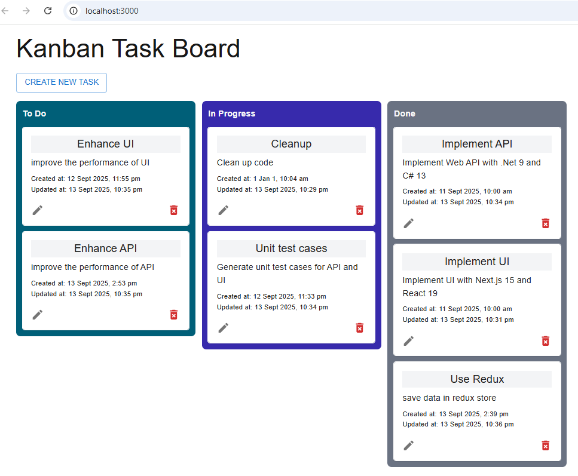

# KanbanBoardApp

Kanban board application by Greg Luo (greg.luo@outlook.com)

## Front-end UI

Implemented using Next.js 15, React 19, Redux, SQLite, pragmatic-drag-and-drop, MUI, React Hook Form, Axios, Jest, and other related technologies.

### setup UI instructions

- install dependencies: npm i
- run UI: npm run dev
- run test cases: num run test

## Back-end Web API

implemented using .NET 9 and C# 13, Entity Framework, and xUnit etc.

### setup SQLite database

- Open PMC: Tools → NuGet Package Manager → Package Manager Console
- Run command: Update-Database. It will apply all existing migrations in order, and create the database if it does not exist.

### setup API instructions

- restores all NuGet packages: dotnet restore
- build the project: dotnet build
- run the project: dotnet run

  or

- open the solution in Visual Studio 2022
- hit F5 to run and debug
- right click the "KanbanBoard.WebAPI.Tests" project and select "Run Tests" to run unit test cases

